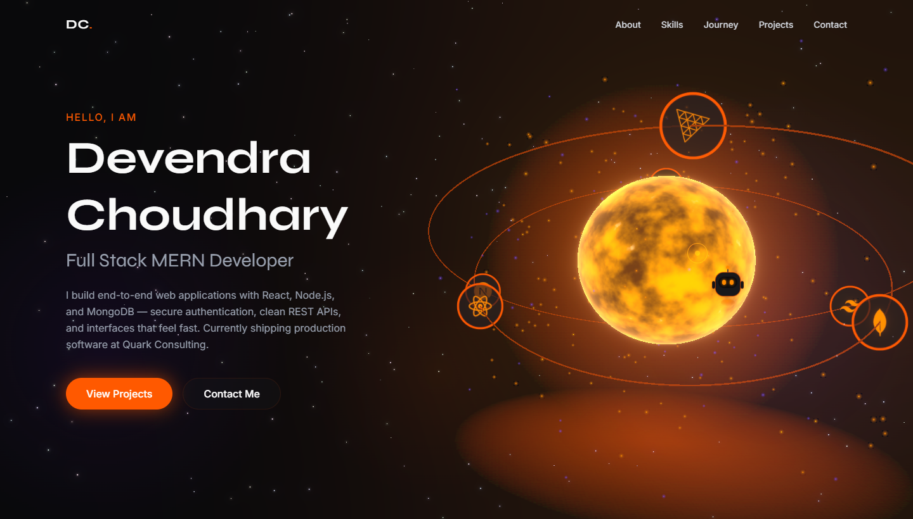

# Devendra Choudhary — Portfolio

A 3D personal portfolio built with Next.js and React Three Fiber. Custom GLSL plasma shader, a scroll-driven orbital timeline, and a cursor companion — with graceful fallbacks so phones and reduced-motion visitors get a fast, clean experience instead of a heavy WebGL scene.

**🔗 Live site → [dev-portfolio-nu-ashen.vercel.app](https://dev-portfolio-nu-ashen.vercel.app)**



## Highlights

- **Plasma sun (custom shader)** — a GLSL fragment shader with layered fBm noise renders a boiling star surface with a fresnel rim and pulsing corona. Shared by the hero and journey scenes.
- **Scroll-driven orbit timeline** — the "Journey" section pins full-screen while career milestones orbit the sun; each docks into focus as you scroll, synced to a glass info card.
- **Sparky, the cursor companion** — a small robot that trails the cursor with spring physics and runs a state machine (following → bored → asleep), reacting to clicks and hovers.
- **Performance-gated 3D** — WebGL scenes only mount on desktop-class devices with a fine pointer and WebGL support; mobile, no-WebGL, and reduced-motion visitors get lightweight static and timeline fallbacks. Render loops pause when a scene scrolls off screen.
- **Lighthouse (mobile):** Performance ~90 · Accessibility 95 · Best Practices 100 · SEO 100.

## Tech stack

| Layer | Choice |
| --- | --- |
| Framework | Next.js 16 (App Router) · React 19 · TypeScript |
| Styling | Tailwind CSS v4 |
| 3D | React Three Fiber · drei · three.js · postprocessing (bloom) |
| Motion | Motion (Framer Motion) · Lenis smooth scroll |
| Forms | Web3Forms (no backend) |
| Hosting | Vercel |

## Running locally

```bash
git clone https://github.com/1devchoudhary/dev-portfolio.git
cd dev-portfolio
npm install
```

Create a `.env.local` with a free [Web3Forms](https://web3forms.com) key (only needed for the contact form):

```bash
NEXT_PUBLIC_WEB3FORMS_KEY=your_access_key_here
```

Then:

```bash
npm run dev     # http://localhost:3000
npm run build   # production build
```

## Editing content

All copy — bio, skills, journey milestones, projects, and social links — lives in one typed file:

```
src/data/content.ts
```

Edit it there and every section updates; no component changes needed.

## Project structure

```
src/
├─ app/              # layout, SEO metadata, sitemap, robots, favicon
├─ components/
│  ├─ Hero/          # hero section + WebGL scene
│  ├─ Journey/       # scroll-driven orbit + mobile timeline fallback
│  ├─ Projects/      # case-study cards with generated visuals
│  ├─ three/         # PlasmaSun (shared shader component)
│  └─ UI/            # cursor, Sparky, magnetic buttons, smooth scroll
├─ data/content.ts   # all site content
└─ lib/site.ts       # site URL + SEO config
```

## Deployment

Deployed on Vercel; pushes to `main` deploy automatically. Set `NEXT_PUBLIC_WEB3FORMS_KEY` (and optionally `NEXT_PUBLIC_SITE_URL`) in the Vercel project's environment variables.

---

Built by [Devendra Choudhary](https://github.com/1devchoudhary) · [LinkedIn](https://www.linkedin.com/in/devendra-choudhary-2a538a1b3/)
